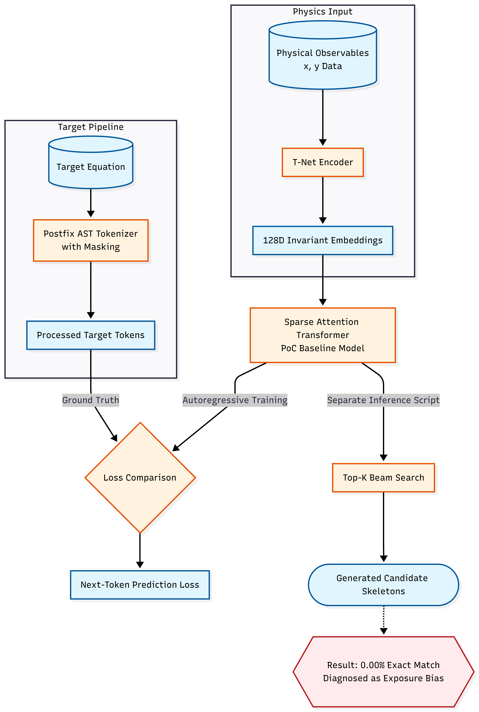
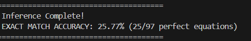
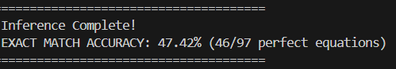
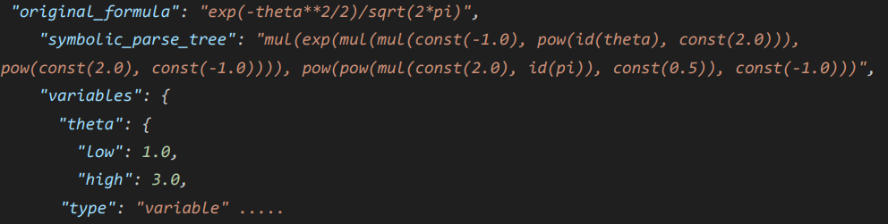
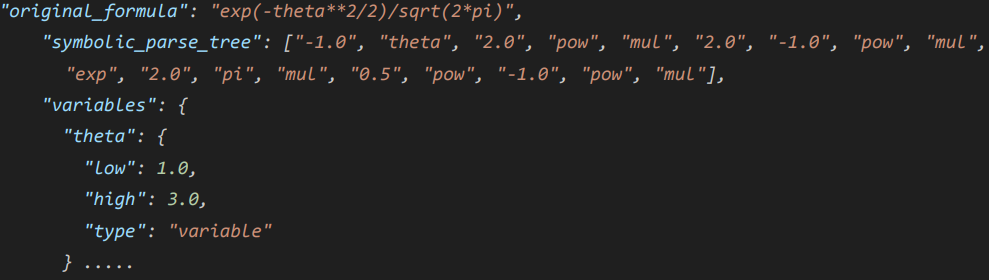
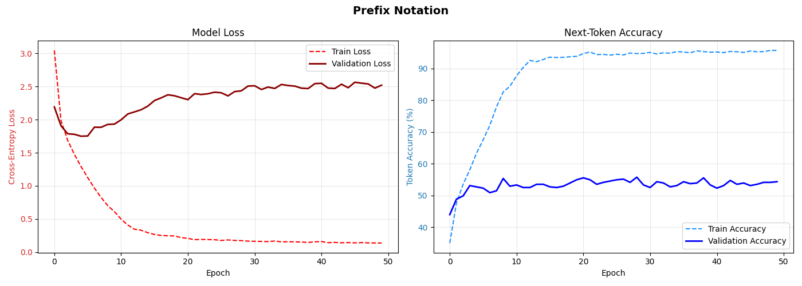
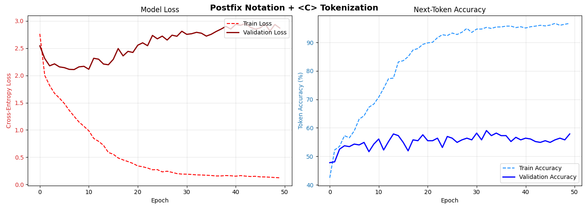
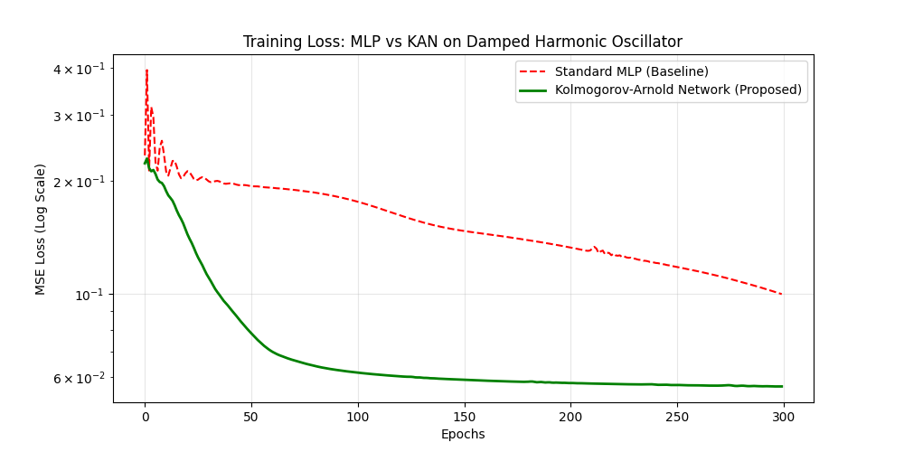
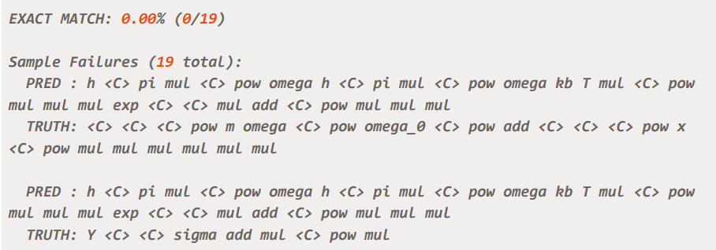

<h1>Symba 2026: Next-Gen Transformers for Symbolic Regression</h1>

<strong><h4 align="center">Read the Full GSoC 2026 Proposal: <a href="https://docs.google.com/document/d/1WaaLbe_9OeSylVhjENV5TdaDmsZNnZ357YENC6tNcUw/edit?usp=sharing">Symba 2026 Proposal (Google Docs)</a></strong>
</h4>

<em><strong><h5>Note on Parallel Submission:</strong> While this repository branch focuses on search-augmented text generation (Task 2.6), I have also architected and submitted a highly synergistic parallel proposal for <strong>LM-JEPA for Symbolic Regression</strong>(Task 2.7). That proposal abandons text generation entirely in favor of continuous latent-space prediction. </h5>
<a href="https://docs.google.com/document/d/1j8NAA6b-6zpPlglhggNHf5iv9rBzBXs1lFekACsmZC0/edit?usp=sharing">Read my LM-JEPA Proposal Here</a> | <a href="https://github.com/Mannan-15/SYMBA/tree/LM-JEPA/SYMBA_REG/LM-JEPA_Mannan">View the LM-JEPA Code Branch</a></em>

This codebase contains the Proof of Concept (PoC) experiments and architectural upgrades designed for my GSoC 2026 proposal.

This repository directly addresses the following ML4SCI Common Tasks:

<blockquote>
  
<strong>Common Task 1.1: Dataset Preprocessing</strong> 
  <strong>Dataset:</strong> <a href="https://space.mit.edu/home/tegmark/aifeynman.html">AI Feynman</a> <em>(Note: Authors not affiliated with ML4SCI)</em> 
  <strong>Description:</strong> Download the <code>Feynman_with_units.tar.gz</code> features and corresponding <code>FeynmanEquations.csv</code> targets. Preprocess and tokenize the target data and document your rationale for the choice of tokenization.

</blockquote>

<blockquote>
  
<strong>Common Task 2.6: Next-Gen Transformers Seeding Generative Models</strong> 
  <strong>Description:</strong> Use a Transformer model to seed a generative technique for symbolic regression. Build on previous code solutions from ML4SCI GSoC 2025 combining models and generative frameworks.

</blockquote>

<h2>Quick Links for Evaluators</h2>

To make reviewing the evaluation tasks as seamless as possible, here is exactly where the relevant code and data for each task are located:

<h3>Task 1.1: Tokenization &amp; Parsing</h3>
<ul>
  <li><strong>The Parser:</strong> <a href="https://github.com/Mannan-15/SYMBA/blob/Mannan-upgrade/SYMBA_REG/Upgrade_Mannan/src/parser/symbolic_parser.py">src/parser/symbolic_parser.py</a></li>
  <li><strong>Tokenized Target Data:</strong> The fully parsed and tokenized postfix equations are stored in <a href="https://github.com/Mannan-15/SYMBA/blob/Mannan-upgrade/SYMBA_REG/Upgrade_Mannan/src/parser/symbolic_parser.py">src/parser/feynman_parse_trees_postfix.json</a></li>
  <li><strong>Vocab Builder:</strong> The Postfix vocabulary builder logic is located in <a href="https://github.com/Mannan-15/SYMBA/blob/Mannan-upgrade/SYMBA_REG/Upgrade_Mannan/src/models/vocab_builder_postfix.py">src/models/vocab_builder_postfix.py</a></li>
  <li><strong>T-Net Embeddings: </strong><a href="https://github.com/Mannan-15/SYMBA/blob/Mannan-upgrade/SYMBA_REG/Upgrade_Mannan/src/embeddings/t_net_embeddings.py">src/embeddings/t_net_embeddings.py</a></li>
</ul>

<h3>Task 2.6: Next-Gen Transformer Models</h3>

All architectural experiments and model scripts are located in the <code>src/models/</code> directory. 
<em>(Note: Any file with "old" in the name, such as <code>old_sliding_window.py</code>, refers to the previous 2024/2025 baseline from Krish Malik's proposal and is included purely for benchmarking comparisons).</em>

<ul>
  <li><code>sliding_window.py</code>: The proposed upgraded model utilizing TNet embeddings, continuous <code>&lt;C&gt;</code> tokenization, and Postfix encoding. (<a href="https://github.com/Mannan-15/SYMBA/blob/Mannan-upgrade/SYMBA_REG/Upgrade_Mannan/src/models/sliding_window.py">src/models/sliding_window.py</a>)</li>
  <li><code>updated_sliding_window.py</code>: The proposed model equipped with Beam Search inference to output Top-K candidate skeletons. (<a href="https://github.com/Mannan-15/SYMBA/blob/Mannan-upgrade/SYMBA_REG/Upgrade_Mannan/src/models/updated_sliding_window.py">src/models/updated_sliding_window.py</a>)</li>
  <li><code>kan_mlp.py</code>: The isolated experiment benchmarking Kolmogorov-Arnold Networks (KAN) against standard MLPs for the Transformer blocks. (<a href="https://github.com/Mannan-15/SYMBA/blob/Mannan-upgrade/SYMBA_REG/Upgrade_Mannan/src/models/kan_mlp.py">src/models/kan_mlp.py</a>)</li>
</ul>

<h2>How to Run the Models</h2>

To replicate my experiments and run the proposed architectures locally, follow these steps:

<strong>1. Clone the repository and navigate to the upgrade directory:</strong>

<pre><code>git clone -b Mannan-upgrade --single-branch https://github.com/Mannan-15/SYMBA.git
cd ./SYMBA_REG/Upgrade_Mannan</code></pre>

<strong>2. Parse the AI Feynman Dataset (Task 1.1):</strong> 
First, execute the symbolic parser to convert the raw equations into mathematically compressed Postfix JSON parse trees:

<pre><code>python3 src/parser/symbolic_parser.py</code></pre>

<strong>3. Build the Postfix Vocabulary (Task 1.1):</strong> 
Next, generate the continuous <code>&lt;C&gt;</code> token mappings and the final vocabulary file required by the encoders:

<pre><code>python3 src/models/vocab_builder_postfix.py</code></pre>

<strong>4. Run the Proposed Postfix Decoder (Standard Inference):</strong>

<pre><code>python3 src/models/sliding_window.py</code></pre>

<strong>5. Run the Beam Search Inference (Generative Seeding):</strong> 
To run the Top-K beam search decoder used to uncover exposure bias and seed the MCTS:

<pre><code>python3 src/models/updated_sliding_window.py</code></pre>

<strong>6. Run the KAN vs. MLP Experiment:</strong> 
Benchmarks the Kolmogorov-Arnold Network against standard linear MLPs for physical geometries:

<pre><code>python3 src/models/kan_mlp.py</code></pre>

<strong>7. Run the Legacy Prefix Baseline (For Comparison):</strong> 
To run the original 2025's baseline model and observe the sequence bloat and baseline accuracy:

<pre><code>python3 src/baselines/old_sliding_window.py</code></pre>

<h2>Key Experiments &amp; Architectural Updates</h2>

<b>(For deep technical proofs and loss landscape graphs, please refer to Section 2 of the proposal)</b>

To fulfill these tasks, I audited the 2025's Krish Malik's proposal and engineered three major architectural upgrades. Below is the end-to-end generative pipeline implemented for task:

<h3>1. Tokenization Rationale: Postfix + <code>&lt;C&gt;</code> (Task 1.1)</h3>

The legacy baseline relied on bloated Prefix notation and discrete digit prediction, which caused massive sequence lengths and severe hallucination of physical constants. To fix this, I engineered a mathematically enforced <strong>Postfix + <code>&lt;C&gt;</code> Tokenizer</strong>.

<ul>
<li><strong>Data Encoding (T-Net):</strong> I integrated the T-Net encoder for the physical tabular data <code>(x)</code>. Its permutation-invariant architecture handles unordered sets of physical observations without injecting artificial sequence biases.</li>
 <li><strong>Postfix vs. Prefix + <code>&lt;C&gt;</code> Tokenization:</strong> I engineered a mathematically enforced Postfix tokenizer that completely removes redundant parentheses and replaces discrete floating-point numbers with a continuous embedding token.</li>
  <li><strong>Compute Reinvestment (The "Headroom" Advantage):</strong> The tokenizer completely strips structural bloat, dropping the maximum sequence length from 67 down to 49 tokens (~30% compression). This drastically reduces both the Transformer's <code>O(N^2)</code> self-attention compute cost and the MCTS search tree <code>O(b^D)</code>, buying back structural headroom to learn complex physics for "free."</li>
<li><strong>Impact:</strong> Because Postfix removes redundant tokens (like closing brackets) that trivially inflate training metrics, it demonstrates vastly superior true generalization. The proposed pipeline nearly doubled the Exact Match accuracy from <strong>25.7% (Baseline Prefix) to 47.4% (Proposed Postfix)</strong>, while improving Validation Accuracy from <strong>52.1% to 56.3%</strong>.</li>
</ul>

Furthermore, the training curves reveal that while the Prefix baseline flatlined after ~40 epochs, the Postfix loss remained dynamic indicating that training beyond this 50 epochs PoC will yield even higher ultimate accuracy.

<b>Left:</b> Prefix + <code>&lt;C&gt;</code> &nbsp;&nbsp;&nbsp;&nbsp;&nbsp;
<b>Right:</b> Proposed Postfix + <code>&lt;C&gt;</code>

 

 &nbsp;&nbsp;

 &nbsp;&nbsp;

 &nbsp;&nbsp;

<h3>2. Next-Gen Generative Core: KAN vs. MLP (Task 2.6)</h3>

To upgrade the Transformer blocks, I experimented with replacing standard feed-forward MLPs with Kolmogorov-Arnold Networks (KANs), testing them on a noisy physical dataset <code>(y = e^(-0.1x) * sin(3x) + noise)</code>.

<ul>
<li><strong>Result:</strong> By replacing static node activations with learnable, continuous B-spline functions on the edges, the KAN natively maps to physical geometries drastically better than linear weights. The KAN converged significantly faster and achieved a much lower ultimate MSE floor.</li>
</ul>

<h3>3. Inference Upgrades: Beam Search &amp; Exposure Bias (Task 2.6)</h3>

To properly seed a generative Monte Carlo Tree Search (MCTS), a model must output Top-K candidate skeletons rather than a single greedy prediction.

<ul>
<li><strong>Discovery:</strong> Upgrading the baseline decoder to utilize Beam Search (<code>src/models/updated_sliding_window.py</code>) caused the model to collapse, yielding a <strong>0.00% Exact Match</strong> across test samples.</li>
<li><strong>Diagnosis:</strong> This revealed severe <strong>Exposure Bias</strong>. Because the baseline is trained purely with teacher forcing, it never learns to recover from its own autoregressive mistakes during inference. This proves standard next-token prediction is insufficient for generative seeding, directly necessitating the <strong>GRPO Alignment Loop</strong> proposed in Section 3 of my formal proposal.</li>
</ul>

<h2>Repository Navigation</h2>
<ul>
  <li><code>src/baselines/</code>: The original 2025 Prefix + <code>&lt;C&gt;</code> &amp; Greedy decoding scripts used for benchmarking.</li>
  <li><code>src/models/</code>: The updated Postfix Decoder, Beam Search logic, and KAN experiments.</li>
  <li><code>src/parser/</code>: The custom Postfix AST and continuous token masking logic.</li>
  <li><code>src/embeddings/</code> &amp; <code>src/labels/</code>: Custom continuous embeddings and newly generated Postfix JSON parse trees.</li>
</ul>
